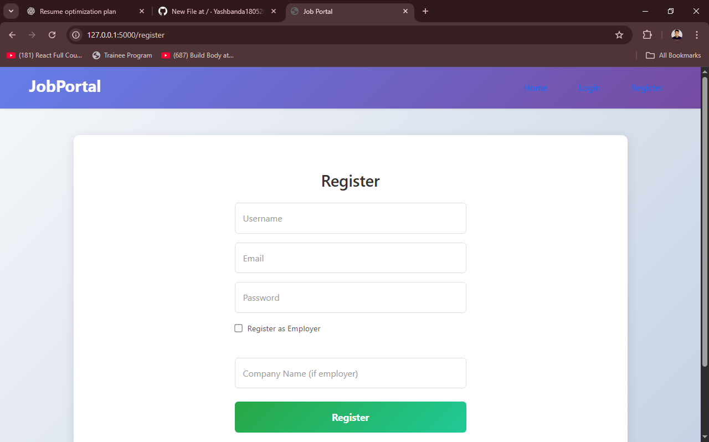
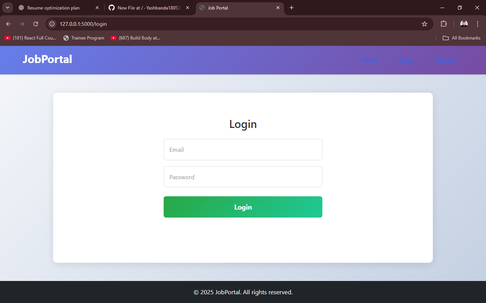
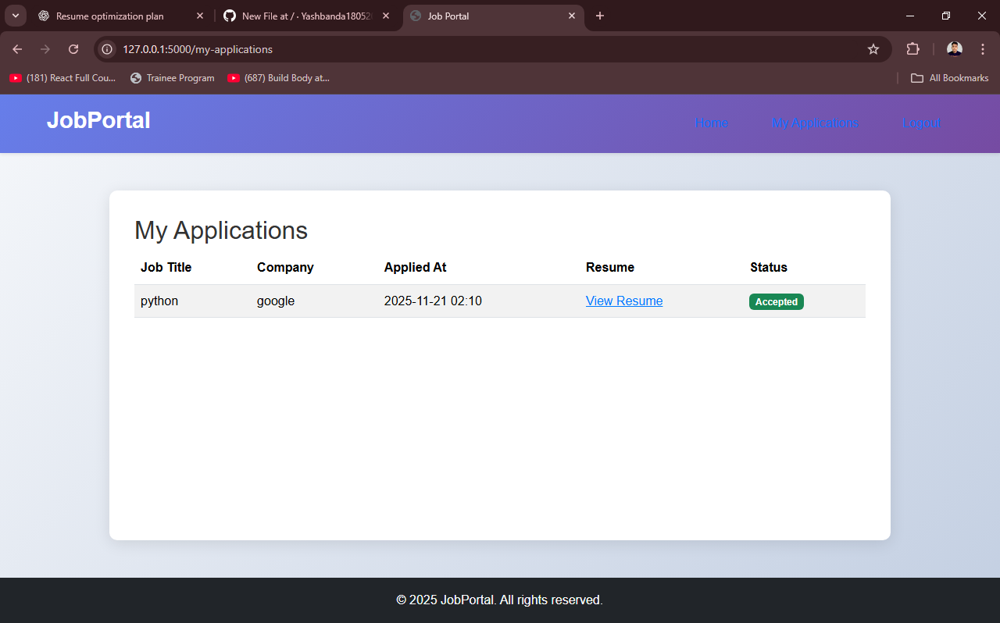
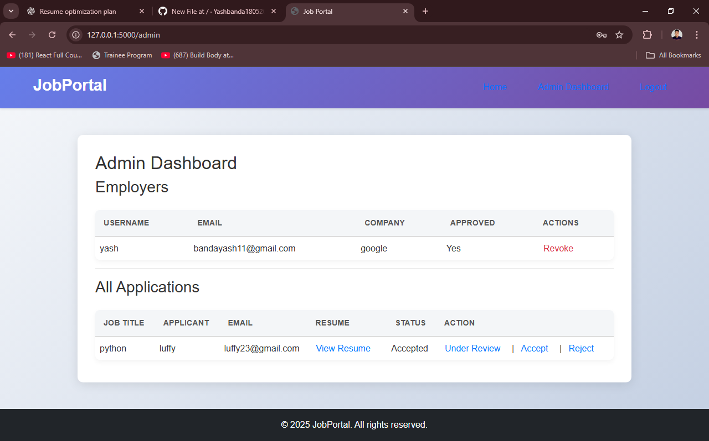
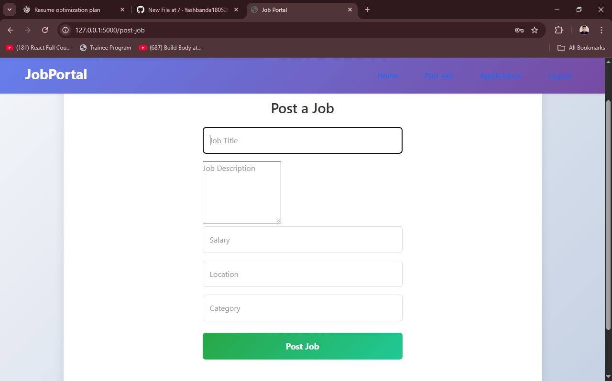

📌 Job Portal Web App

A full-stack job posting and application platform built using Flask.
The system supports User and Admin roles, job CRUD operations, resume uploads, authentication, and an admin dashboard to manage job listings and applications.

🚀 Features
👤 User

Register & login

View all job openings

Apply to jobs

Upload resumes (PDF/DOC)

Track applied jobs

🛠 Admin

Login to admin panel

Add / Edit / Delete job postings

View all applicants

View and download resumes

Manage application status

🧩 Tech Stack

Backend: Flask, SQLAlchemy

Frontend: HTML, CSS, Bootstrap, Jinja2

Database: SQLite / MySQL

Others: Werkzeug Security, File Uploads

/project
│──── /static
│──── /templates
│──── app.py
│──── models.py
│──── forms.py
│──── config.py

pip install -r requirements.txt
python app.py

